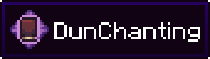

<h2>
<b>A faithful port of the enchanting system from Minecraft Dungeons</b>
</h2>
 

 

# What exactly does this mod change?

---
This mods completely replaces the vanilla enchanting system. Now, players earn enchantment points by leveling up which
can be spent in an enchantment table. Enchantment points can also be refunded in the grindstone.

# Is this compatible with X enchantment mod?

---
Yes and No. DunChanting aims to have 100% enchantment mod compatibility. However, the project is in alpha and issues
are expected. If your favorite enchantment mod doesn't work, create an issue report!

# What about Easy Anvils / Easy Magic? Do those work?

---
No. DunChanting completely overhauls the enchantment table, grindstone, and anvil. Having any Easy mods may lead to
unexpected behavior and possible crashes.

## License

---
This project is under an MIT license